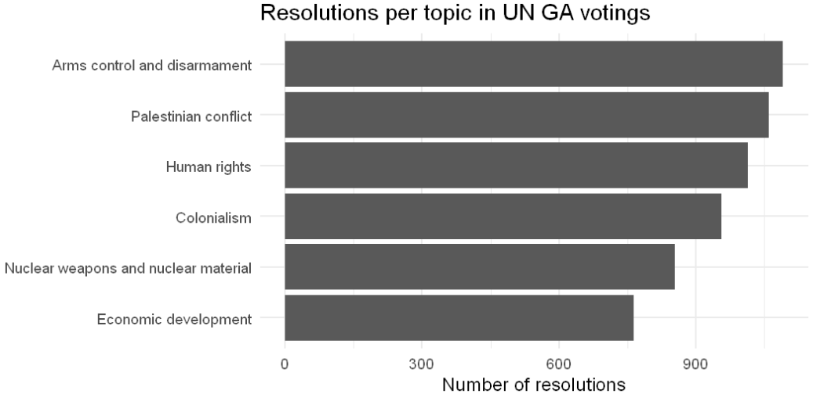
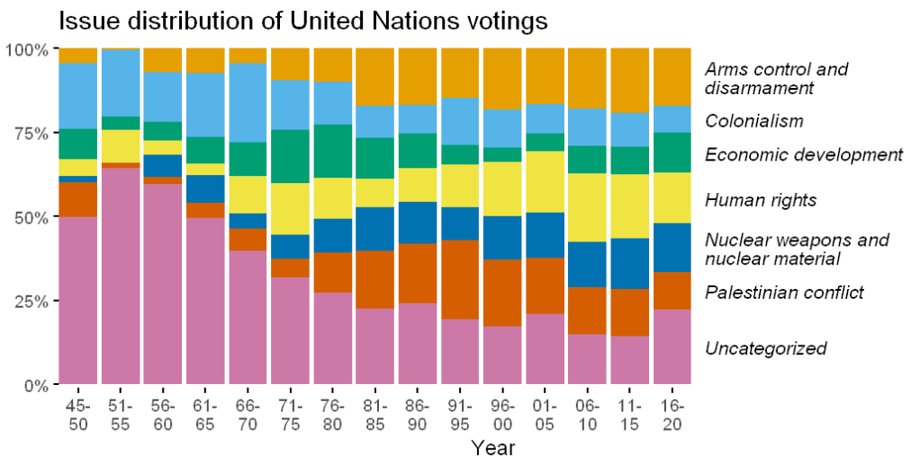
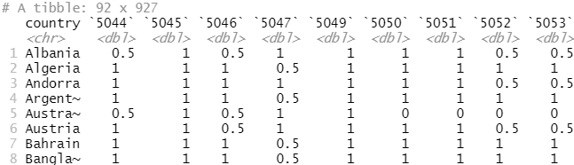

<!-- exclude -->
```{r rsqlite-setup, eval = FALSE}
library(RSQLite)
# https://github.com/rfordatascience/tidytuesday/blob/master/data/2021/2021-03-23/readme.md
tuesdata <- tidytuesdayR::tt_load('2021-03-23')

unvotes <- tuesdata$unvotes
roll_calls <- tuesdata$roll_calls
issues <- tuesdata$issues

# https://db.rstudio.com/databases/sqlite/
# https://db.rstudio.com/dplyr/
# https://dbplyr.tidyverse.org/articles/dbplyr.html
con <- dbConnect(RSQLite::SQLite(), "unvotes.sqlite")
dbListTables(con)

dbWriteTable(con, "unvotes", unvotes)
dbWriteTable(con, "roll_calls", roll_calls)
dbWriteTable(con, "issues", issues)

dbListTables(con)
dbDisconnect(con)
```

## Intro 

Today we're looking at data from the General Assembly of the United Nations.

The data is provided by the [TidyTuesday community](https://github.com/rfordatascience/tidytuesday/blob/master/data/2021/2021-03-23/readme.md) and comprises three tables:

- `unvotes` contains the voting decision (yes/no/abstain) of each country for every issue/resolution
- `roll_calls` contains information on each resolution, e.g., the voting date, the session number and a description
- `issues` contains the issue code and a descriptive topic name 

<!-- exclude -->
<!-- - "Nuclear weapons and nuclear material" -->
<!-- - "Human rights" -->
<!-- - "Economic development"  -->

I placed the three tables in a `.sqlite` database to show you how to work with large data frames using dplyr.

Working with data frames stored in databases is useful if:

- Your data is already in a database
- Your data volume is that high that it does not all fit in memory at once

See also the [dbplyr vignette](https://cran.r-project.org/web/packages/dbplyr/vignettes/dbplyr.html)

## Research questions

- RQ 1: Which topics were voted on most frequently?
- RQ 2: How did the number of roll calls change over time?
- RQ 3: How did the importance of issues change over time?
- RQ 4: Are there subgroups of countries with different voting behavior?  

## Loading the data

Here, we could copy the tables of the DB into memory, because they aren't that large.
But I want to show some of the functionalities in case you run into a real database where the tables don't fit into memory.

```{r setup}
library(tidyverse)

theme_set(theme_minimal(base_size = 18))

knitr::opts_chunk$set(
  fig.width = 28 / 2.54,
  fig.height = 14 / 2.54
)
```

```{r connect-to-database}
library(RSQLite)
# Connect to database
con <- dbConnect(RSQLite::SQLite(), "unvotes.sqlite")
# List all tables
_____

# We can use tbl() to take a reference to a table in the database:
unvotes_db <- tbl(_____)
# When printing, the table mostly looks like a regular tibble.
# The main difference is that it's a remote source in a SQLite database.
unvotes_db
# Close the connection:
# dbDisconnect(con)
```

<!-- exclude -->
```{r connect-to-database}
library(RSQLite)
# Connect to database
con <- dbConnect(RSQLite::SQLite(), "unvotes.sqlite")
# List all tables
dbListTables(con)

# We can use tbl() to take a reference to a table in the database:
unvotes_db <- tbl(con, "unvotes")
# When printing, the table mostly looks like a regular tibble.
# The main difference is that it's a remote source in a SQLite database.
# only the first 1000 rows -> unvotes_db %>% nrow()
# We want to View() the data
# -> Only a reference
unvotes_db
# Close the connection:
# dbDisconnect(con)
```

See also the [RStudio website for working with databases](https://db.rstudio.com).

## Writing SQL code

We can write actual SQL code:

```{r wow-i-can-run-sql-code-from-r}
dbGetQuery(con, 'SELECT * FROM unvotes WHERE country_code = "US" LIMIT 5')
```

We can even add SQL code chunks to an R Markdown document:

_____

<!-- exclude -->
```{sql connection=con}
SELECT * FROM unvotes WHERE country_code = "US" LIMIT 5
```

The most important difference between _ordinary data frames_ and _remote database_ queries is that your R code is translated into SQL and executed in the database, not in R. 
When working with databases, dplyr tries to be as lazy as possible:

- It never pulls data into R unless you explicitly ask for it.
- It delays doing any work until the last possible moment: it collects together everything you want to do and then sends it to the database in one step.

See also RStudio's guide on [`dbplyr`](https://dbplyr.tidyverse.org/articles/dbplyr.html).


_Do you see a difference in the output of the remote data frame in the following code chunk compared to an in-memory data frame?_

```{r seemless-dplyr-with-database-tables}
unvotes_db %>%
  filter(country_code == "US") %>%
  head(5)
```

<!-- exclude -->
```{r}
unvotes_db %>%
  filter(country_code == "US") %>%
  slice(1:5)
```

<!-- exclude -->
```{r}
# Slice does not work with relational databases because they have no intrinsic notion of row order. If you want to perform the equivalent operation, use filter() and row_number().
```

<!-- exclude -->
```{r}
unvotes_db %>%
  filter(country_code == "US") %>%
  filter(row_number() <= 5) 
```

Let's do something more useful with the data.

## Calculate the percentage of 'yes' votes per country

```{r perc-of-yes-per-country}
unvotes_db %>%
  group_by(_____) %>%
  summarize(perc_yes = 100 * _____)
```


<!-- exclude -->
<!-- - show_query() -> translate dplyr code to sql -->
<!-- - copy to SQL code chunk -->
```{r perc-of-yes-per-country}
unvotes_db %>%
  group_by(country) %>%
  summarize(perc_yes = 100 * sum(vote == "yes") / n()) %>%
  show_query() #!!!
```

<!-- exclude -->
```{r}
# collect()
# Typically, you’ll iterate a few times before you figure out what data you need from the database. 
# Once you’ve figured it out, use collect() to pull all the data down into a local tibble.
# unvotes_db
# unvotes_db %>% collect()
```

## Load all tables into memory

```{r load-all-tables-into-memory}
library(RSQLite)
# dbDisconnect(con) #close potentially open connections
con <- dbConnect(RSQLite::SQLite(), "unvotes.sqlite")
unvotes <- collect(tbl(con, "unvotes"))
issues <- collect(tbl(con, "issues"))
roll_calls <- collect(tbl(con, "roll_calls"))
dbDisconnect(con)
```

## RQ 1: Which topics were voted on most frequently?

We visualize the number of votings per issue category.

```{r most-pressing-topics}
issues %>% 
  # "count" the number of observations for each issue
  _____(issue) %>% 
  # put the count variable on the x-axis, put `issue` on the y-axis
  ggplot(aes(x = _____, y = _____)) +
  # geom_bar() vs. geom_col()?
  _____() +
  labs(
    title = "Resolutions per topic in UN GA votings",
    x = "Number of resolutions",
    y = NULL
  )
```

The output should look as follows:

```{r}

```

<!-- exclude -->
```{r most-pressing-topics}
issues %>% 
  # "count" the number of observations for each issue
  count(issue) %>% 
  # put the count variable on the x-axis, put `issue` on the y-axis
  ggplot(aes(x = n, y = fct_reorder(issue, n))) +
  # geom_bar() vs. geom_col()?
  geom_col() +
  labs(
    title = "Resolutions per topic in UN GA votings",
    x = "Number of resolutions",
    y = NULL
  )
# <!-- https://forcats.tidyverse.org/ -->
```

## RQ 2: How did the number of roll calls change over time?

We want to show the number of votings per year over time.
Therefore, we need to extract the year of the voting. 
First, we need to convert the date column from `double` to `Date` (`lubridate::as_date`).

```{r votings-per-year}
roll_calls %>%
  # convert from double (number of days before 01-01-1970 (Unix epoch)) to `date`
  mutate(date_clean = lubridate::_____(date)) %>%
  # extract year component from date
  mutate(year = lubridate::_____(date_clean)) %>%
  # make a bar plot showing the year on the x-axis and the number of votings on the y-axis
  ggplot(aes(_____)) +
  geom______() +
  labs(
    x = "Year",
    y = "Number of votings",
    title = "UN GA votings by year"
  )
```

<!-- exclude -->
```{r votings-per-year}
roll_calls %>%
  # convert from double (number of days before 01-01-1970 (Unix epoch)) to `date`
  mutate(date_clean = lubridate::as_date(date)) %>%
  # extract year component from date
  mutate(year = lubridate::year(date_clean)) %>%
  # make a bar plot showing the year on the x-axis and the number of votings on the y-axis
  ggplot(aes(x = year)) +
  geom_bar() +
  labs(
    x = "Year",
    y = "Number of votings",
    title = "UN GA votings by year"
  )
```

<!-- exclude, delete -->
```{r}
roll_calls %>%
  mutate(date_clean = lubridate::as_date(date)) %>%
  select(rcid, session, importantvote, date_clean) %>%
  mutate(year = lubridate::year(date_clean)) %>%
  mutate(year_disc = cut(
    year, 
    breaks = c(seq(1945,2020, 5)),
    labels = paste0(c(1945, seq(1951, 2016, 5)), "-", seq(1950,2020,5))
    )) %>%
  mutate(year_disc = str_replace(year_disc, "\\d{2}(\\d{2})-\\d{2}(\\d{2})", "\\1-\\2")) %>%
  mutate(year_disc = fct_reorder(year_disc, year)) %>%
  ggplot(aes(x = year_disc)) +
  geom_bar()
```
<!-- https://stringr.tidyverse.org/ -->


## RQ 3: How did the importance of issues change over time?

```{r issue-proportion-over-time-data}
df <- roll_calls %>%
  select(rcid, date) %>%
  mutate(date_clean = lubridate::as_date(date)) %>%
  mutate(year = lubridate::year(date_clean)) %>%
  # create bins of 5 years
  mutate(year_disc = cut(
    year, 
    breaks = c(seq(1945,2020, 5)),
    labels = paste0(c(1945, seq(1951, 2016, 5)), "-", seq(1950,2020,5))
    )) %>%
  # prettify factor levels
  mutate(year_disc = str_replace(year_disc, "\\d{2}(\\d{2})-\\d{2}(\\d{2})", "\\1-\n\\2")) %>%
  # order the factor levels by year
  # # fct_reorder(c("51-55", "16-20"), c(1951,2016))
  mutate(year_disc = fct_reorder(year_disc, year)) %>%
  select(rcid, year_disc)

# Join `df` with `issues`; keep all votings from `df`
df_plot <- _____join(df, issues, by = "rcid") %>%
  # some roll calls are not assigned to an issue category
  # make NA values of `issue` explicit, i.e., convert them to an additional factor level
  mutate(issue = fct_____(issue, na_level = "Uncategorized"))

label_pos <- df_plot %>%
  # filter last year in the data
  filter(year_disc == _____) %>%
  # count the number of votings per issue
  count(_____) %>%
  # compute relative count of votings
  mutate(perc = _____) %>%
  # sort rows by factor order 
  arrange(desc(issue)) %>%
  # position of the label equals the sum of proportions of the issues below plus half of an issue's own proportion
  mutate(pos = cumsum(lag(perc, default = 0)) + 0.5 * perc)
```

<!-- exclude -->
```{r issue-proportion-over-time-data}
df <- roll_calls %>%
  select(rcid, date) %>%
  mutate(date_clean = lubridate::as_date(date)) %>%
  mutate(year = lubridate::year(date_clean)) %>%
  # create bins of 5 years
  # cut(1:10, breaks = c(0,5,10))
  mutate(year_disc = cut(
    year, 
    breaks = c(seq(1945,2020, 5)),
    labels = paste0(c(1945, seq(1951, 2016, 5)), "-", seq(1950,2020,5))
    )) %>%
  # prettify factor levels
  mutate(year_disc = str_replace(year_disc, "\\d{2}(\\d{2})-\\d{2}(\\d{2})", "\\1-\n\\2")) %>%
  # order the factor levels by year
  mutate(year_disc = fct_reorder(year_disc, year)) %>%
  select(rcid, year_disc)

# Join `df` with `issues`; keep all votings from `df`
df_plot <- left_join(df, issues, by = "rcid") %>%
  # some roll calls are not assigned to an issue category
  # make NA values of `issue` explicit, i.e., convert them to an additional factor level
  mutate(issue = fct_explicit_na(issue, na_level = "Uncategorized"))

label_pos <- df_plot %>%
  # filter last year in the data
  filter(year_disc == levels(year_disc)[nlevels(year_disc)]) %>%
  # count the number of votings per issue
  count(issue) %>%
  # compute relative count of votings
  mutate(perc = n / sum(n)) %>%
  # sort rows by factor order 
  arrange(desc(issue)) %>%
  # position of the label equals the sum of proportions of the issues below plus half of an issue's own proportion
  mutate(pos = cumsum(lag(perc, default = 0)) + 0.5 * perc)
```

```{r issue-proportion-over-time-plot}
# year bins on x-axis, fill bars by issue
ggplot(df_plot, aes(_____ = _____, _____ = _____)) +
  geom_bar(position = "fill") +
  colorblindr::scale_fill_OkabeIto() +
  theme(panel.grid = element_blank()) +
  theme(axis.ticks = element_line()) +
  labs(x = "Year", y = NULL,
       title = "Issue distribution of United Nations votings")
```


<!-- exclude -->
```{r issue-proportion-over-time-plot}
# year bins on x-axis, fill bars by issue
ggplot(df_plot, aes(x = year_disc, fill = issue)) + 
  # add padding to the right side of the panel to add labels
  scale_x_discrete(expand = c(0, 0, 0, 6)) + #<
  # format y-axis labels as percent values
  scale_y_continuous(expand = c(0.01,0), labels = scales::percent) + #<
  geom_bar(position = "fill") + 
  geom_text(data = label_pos, #<
            aes(y = pos, label = str_wrap(issue, 20)),
            x = nlevels(df_plot$year_disc) + 0.75,
            inherit.aes = FALSE,
            size = 16 / .pt,
            hjust = 0, lineheight = 0.85,
            fontface = "italic"
  ) +
  guides(fill = FALSE) + #<
  colorblindr::scale_fill_OkabeIto() +
  theme(panel.grid = element_blank()) +
  theme(axis.ticks = element_line()) +
  labs(x = "Year", y = NULL,
       title = "Issue distribution of United Nations votings")
```

The output should look as follows:

```{r}

```

## RQ 4: Are there subgroups of countries with different voting behavior? 

Cluster and visualize countries based on voting similarity.

Here, we combine the popular kmeans clustering and UMAP dimensionality reduction algorithm to discover and visualize subgroups of countries based on their voting behavior in UN GA votings?

Procedure:

1. Count the number of votes per country in recent years, i.e., after 2009. 
To do so, we need to combine `unvotes` (containing `country`) with `roll_calls` (which contains `date`). 
Calculate quantiles and identify a good threshold for the minimum number of votes a country must have cast.
2. Filter countries that voted "sufficiently" often. (Let's say 900 is the threshold ;-) )
3. Convert `vote` to numeric: no = no, abstain = 0.5, yes = 1
4. Use `complete()` to replace NA with 0.5
5. Reshape data so that we can apply clustering: `pivot_wider()`
6. Apply k-means
7. How to visualize clustering in a 926 dim-space? -> UMAP
8. ggrepel to highlight representative countries.

```{r voting-quantiles}
# Task 1: 
unvotes %>%
  left_join(roll_calls %>% select(rcid, date)) %>%
  mutate(date = lubridate::as_date(date)) %>%
  filter(lubridate::year(date) >= 2010) %>%
  count(country) %>% 
  summarize(quant = seq(0,1,0.1), value = quantile(n, seq(0,1,0.1)))
```

```{r country-subgroups-based-on-voting-behavior}
df <- unvotes %>%
  # join with roll_calls for date column
  _____(roll_calls %>% select(rcid, date)) %>%
  # convert date from double to date class
  mutate(date = _____(date)) %>%
  # filter votings from 2010 or later
  filter(_____ >= 2010) %>%
  # add number of observations per country as column
  add_count(country) %>%
  # filter countries with at least 900 votings
  filter(_____ >= 900) %>%
  select(rcid, country, vote) %>%
  # if a country didn't vote on a particular roll call, add an observation with `vote == "abstain"`
  complete(rcid, country, fill = list(vote = "abstain")) %>%
  # kmeans requires numeric columns so we convert the answers to numeric
  mutate(vote = case_when(
    vote == "yes" ~ 1,
    vote == "no" ~ 0,
    TRUE ~ 0.5 # abstain
  )) %>%
  # reshape the data such that rows represent countries, columns represent votings, and cells represent how a country voted in a particular voting 
  pivot_wider(names_from = _____, values_from = _____)
```

<!-- exclude -->
```{r country-subgroups-based-on-voting-behavior}
df <- unvotes %>%
  # join with roll_calls for date column
  inner_join(roll_calls %>% select(rcid, date)) %>%
  # convert date from double to date class
  mutate(date = lubridate::as_date(date)) %>%
  # filter votings from 2010 or later
  filter(lubridate::year(date) >= 2010) %>%
  # add number of observations per country as column
  add_count(country) %>%
  # filter countries with at least 900 votings
  filter(n >= 900) %>%
  select(rcid, country, vote) %>%
  # if a country didn't vote on a particular roll call, add an observation with `vote == "abstain"`
  complete(rcid, country, fill = list(vote = "abstain")) %>%
  # kmeans requires numeric columns so we convert the answers to numeric
  mutate(vote = case_when(
    vote == "yes" ~ 1,
    vote == "no" ~ 0,
    TRUE ~ 0.5 # abstain
  )) %>%
  # reshape the data such that rows represent countries, columns represent votings, and cells represent how a country voted in a particular voting 
  pivot_wider(names_from = rcid, values_from = vote)
```

The data frame should look as follows: 

```{r}

```


```{r clustering-dimred-plot}
# apply kmeans without country column
clustering <- kmeans(df %>% select(-country), 2)
str(clustering)

# apply UMAP
set.seed(123)
projection <- umap::umap(df %>% select(-country))
plot_data <- as_tibble(projection$layout) %>%
  mutate(cluster_id = clustering$cluster) %>%
  mutate(country = df$country)

# Visualize projection in two-dimensional scatterplot
# Map cluster membership to point color
ggplot(plot_data, aes(x = V1, y = V2, color = as.factor(cluster_id))) +
  geom_point() +
  ggrepel::geom_text_repel(
    data = plot_data %>% slice_sample(n = 35),
    aes(label = country), seed = 7, size = 14/.pt
    ) +
  guides(color = FALSE) +
  theme_void() +
  scale_x_continuous(expand = c(0.5,0)) +
  scale_y_continuous(expand = c(0.3,0))
```


<!-- exclude, delete -->

## Show excerpt of votes for countries from the same and different clusters

1. Filter Germany, Denmark, Syria
2. Bring data back to long (tidy) format
3. Join data with roll_calls to get the description field
4. Need to convert rcid of df to double
5. show only 10 resolutions at once -> dense_rank
6. Show some of the description, str_trunc, str_wrap
7. plot


```{r, fig.height=16/2.54}
df %>%
  filter(country %in% c("Germany", "Denmark", "Qatar")) %>%
  pivot_longer(cols = -country, names_to = "rcid", values_to = "vote") %>%
  mutate(rcid = as.double(rcid)) %>%
  inner_join(roll_calls %>% select(rcid, descr)) %>%
  mutate(rcid_rank = dense_rank(-rcid)) %>%
  # filter(rcid_rank <= 10) %>%
  filter(between(rcid_rank, 31, 40)) %>%
  mutate(descr = paste0(rcid, ": ", descr)) %>%
  mutate(descr = str_trunc(descr, 150)) %>%
  mutate(descr = str_wrap(descr, 80)) %>%
  ggplot(aes(x = country, y = as.factor(descr), fill = as.factor(vote))) +
  geom_text(aes(label = case_when(vote == 0 ~ "✗", vote == 1 ~ "✓", TRUE ~ "o"),
                color = as.factor(vote)),
            size = 10) +
  scale_color_manual(values = c("red", "black", "green")) +
  guides(color = FALSE) +
  scale_x_discrete(position = "top") +
  theme(axis.text.y = element_text(lineheight = 0.8)) +
  labs(x = NULL, y = NULL)
```

