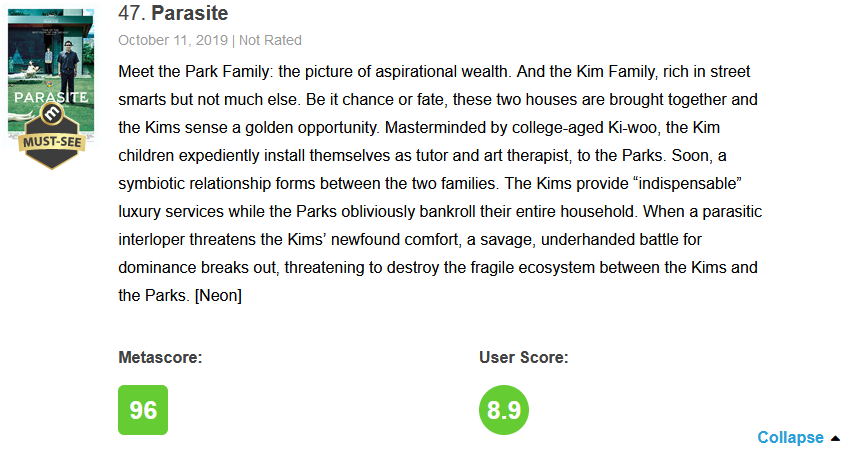

## Make searching for movies on Netflix great again!

I'm sure you know the situation too. 
Sometimes, it feels like it takes me forever to find a good movie or series on a streaming portal like Netflix or Prime Video.

Can we use `R` to automatically sift through promising candidates for our next movie night?

Yes, we can -- by using the **web scraping** package `rvest` in combination with functions and `purrr`'s map functions!

## Web scraping

### Why?

- More and more data are available on the web
- Data often come in a non-tabular format -> copy-and-paste is tedious and error-prone

### What?

> Web scraping is used to extract data from websites in an automated manner, often converting it into a tabular structure for storage in spreadsheets or databases for later retrieval and analysis.

Two main methods:

1. "Traditional" **web scraping**: extracting data from the HTML source code of a website
2. **Web APIs** (Application Programming Interface): 
  - a set of structured HTTP requests that return data in an open standard file format, e.g. JSON or XML
  <!-- - sort of an intermediary between the website and the user  -->

## HTML 101

```{r html-intro, echo=FALSE}

```

(Source: <https://www.w3schools.com/html/html_intro.asp>)

HTML documents imply a structure of nested HTML **elements**. 
This hierarchical structure is rather unsuitable for data analysis.

## rvest

The `rvest` (from the English word (ha)rvest) package makes it easy to download and manipulate HTML.

It is part of the tidyverse, thus works well in `%>%` pipelines.

Fundamental `rvest` functions:

- `read_html()`: read HTML from a URL
- `html_element()`: return a specified element (like `h1`, `table`, `p`) from an HTML document
- `html_elements()`: like `html_element()` but returns _all_ elements matching the selection instead of the first
- `html_table()`: parse an HTML table into a data frame
- `html_text()`/`html_text2()`: extract text from an element
- `html_name()`: extract elements' names
- `html_attrs()`: extract all of each element's attributes
- `html_attr()`: extract a specific attribute from each element by name

## Metacritic.com

[Metacritic](https://www.metacritic.com/) is a website that aggregates reviews of movies, TV shows, and video games.

They provide two _scores_: the **"Metascore"** and the **"User score"**

- The Metascore is a weighted average of the ratings of professional authors of media outlets.
- Some reviewer's ratings receive a higher weight than others.
- However, Metacritic hasn't published its weighting mechanism.
- The User score is the average of all user ratings.

Example:

```{r html-intro, echo=FALSE}

```

(Screenshot from: <https://www.metacritic.com/browse/movies/score/metascore/all/filtered?sort=desc>)

## Task 1: Scrape ratings of movies released in 2021

```{r setup, include = FALSE}
library(tidyverse)
library(rvest) # rvest is part of the tidyverse but no core package so we have to load it separately 

# set default theme
theme_set(
  theme_minimal(base_size = 18) +
    theme(plot.title = element_text(size = rel(1.05)))
)

# set default figure dimensions
knitr::opts_chunk$set(fig.width = 24 / 2.54, fig.height = 18 / 2.54)
```

```{r explore-rvest}
url <- "_____"

# read html of specified url
best_movies <- read_____(url)
best_movies

typeof(best_movies)
class(best_movies)

# extract all <table>...</table> elements
best_movies %>%
  html______("table")
# Why 4 tables? :-/

# extract only the first table
best_movies %>%
  html______("table")

# extract text
best_movies %>%
  html______("table") %>%
  html______()

# ...make this more readable:
best_movies %>%
  html______("table") %>%
  html______()

# ...make this even more readable:
best_movies %>%
  html______("table") %>%
  html______() %>%
  cat() # or writeLines()
```

_Where do we get the names of the elements we want to scrape?_ 

Three alternatives:

- Go through the website's HTML source code in your browser (shortcut CTRL + U)
- Open your browser's developer tools (shortcut F12)
- Use the [SelectorGadget](https://rvest.tidyverse.org/articles/articles/selectorgadget.html) JavaScript bookmarklet

**TASK:** Use the SelectorGadget to extract the HTML element name (or its class attribute) of a movie's **summary text**. 

```{r extract-summary-texts}
best_movies %>%
  html_element("_____") %>%
  html_text2()
```

**TASK:** Use the SelectorGadget to find suitable selectors to scrape a movie's **Metascore**. 

```{r extract-metascores}
best_movies %>%
  html_elements("_____") %>%
  html_text2()
```

Let's successively scrape a movie's title, release date, Metascore and user score.

```{r extract-table}
best_movies %>%
  html_element(".clamp-list") %>%
  html_table()
```

Uh oh... `html_table()` doesn't work here unfortunately.

**Task:** Extract the title.

```{r extract-titles}
titles <- best_movies %>%
  html_elements("_____") %>%
  html_text2()
titles %>% head()
```

**Task:** Extract the release date.

```{r extract-release-dates}
release_dates <- best_movies %>%
  html_elements("_____") %>%
  html_text2()
release_dates %>% head()
```

**Task:** Extract the Metascore.

```{r extract-metascores-1}
meta_scores <- best_movies %>%
  html_elements("_____") %>%
  html_text2()
meta_scores %>% head()
```

**Task:** Extract the user score.

```{r extract-userscores}
user_scores <- best_movies %>%
  html_elements("_____") %>%
  html_text2()
user_scores %>% head()
```

Combine all vectors into a data frame:

```{r create-table}
movie_ratings <- tibble(
  title = titles,
  release_date = release_dates,
  meta_score = meta_scores,
  user_score = user_scores
)
```

## Task 2: Visualize the best rated movies in 2020

Create a bar plot of the 2020 movies with an average of Metascore and user score of >=80.

Map the movie's title to the y-axis and its average score to the x-axis.

```{r top-movie-ratings-in-2020}
movie_ratings %>%
  drop_na() %>%
  mutate(avg_score = _____) %>%
  filter(avg_score >= _____) %>%
  ggplot(
    aes(
      x = _____, 
      y = _____
    )
  ) +
  geom_col() +
  labs(
    x = "Average of Metascore and User score",
    y = NULL,
    title = "Best movies in 2020 according to Metacritic.com"
  )+
  theme(plot.title.position = "plot") +
  theme(plot.title = element_text(hjust = 1))
```

The average score of these movies appears to be much lower than the Metascore. 
Apparently, these are films that do extremely well with the film press and rather mediocrely with ordinary viewers.

## Task 3: Juxtapose Metascores and user scores of the best rated movies in 2020

A dumbbell plot is an alternative to a side-by-side bar plot and great for showing differences between two groups of measurements that are on the same scale.

```{r dumbbell, fig.width=24/2.54, fig.height=22/2.54}
df_dumbbell <- movie_ratings %>%
  drop_na() %>%
  mutate(user_score = 10 * user_score) %>%
  mutate(avg_score = 0.5 * (meta_score + user_score)) %>%
  filter(avg_score >= 80) %>%
  mutate(label = fct_reorder(str_trunc(as.character(title), 30), avg_score)) 

best_movie <- df_dumbbell %>%
  arrange(desc(label)) %>%
  slice(1)

ggplot(df_dumbbell, aes(
    y = label
  )) +
  geom_segment(
    aes(x = user_score , xend = meta_score, yend = label),
    color = "gray50"
  ) +
  geom_point(
    aes(x = user_score),
    color = colorblindr::palette_OkabeIto[1],
    size = 2.25
  ) +
  geom_point(
    aes(x = meta_score),
    color = colorblindr::palette_OkabeIto[2],
    size = 2.25
  ) +
  geom_point(
    aes(x = avg_score),
    color = "black",
    size = 2.75
  ) +
  labs(
    x = NULL,
    y = NULL,
    title = "Best movies in 2020 according to Metacritic.com"
  ) +
  annotate(
    "text",
    x = best_movie$user_score[1], y = n_distinct(df_dumbbell$title) + 0.5, 
    label = "User\nscore",
    vjust = 0, size = 14 / .pt, lineheight = 0.85, fontface = "italic",
    color = colorblindr::palette_OkabeIto[1]
  ) +
  annotate(
    "text",
    x = best_movie$meta_score[1], y = n_distinct(df_dumbbell$title) + 0.5, 
    label = "Meta-\nscore",
    vjust = 0, size = 14 / .pt, lineheight = 0.85, fontface = "italic",
    color = colorblindr::palette_OkabeIto[2]
  ) +
  annotate(
    "text",
    x = best_movie$avg_score[1], y = n_distinct(df_dumbbell$title) + 0.5, 
    label = "Avg.\nscore",
    vjust = 0, size = 14 / .pt, lineheight = 0.85, fontface = "italic"
  ) +
  scale_y_discrete(expand = c(0.02,0,0,2)) +
  # scale_x_continuous(expand = c(0.02, 0, 0.1, 0)) +
  theme(panel.grid.major.y = element_blank()) +
  theme(panel.grid.minor.x = element_blank()) +
  theme(axis.ticks = element_line())
```

How many of the 100 top-movies in 2021 receive better ratings from the users than from the professional critics?

```{r crowd-favorites}

```

<!-- One explanation for this pattern is that users may tend to give more extreme ratings (higher fraction of 10s and 0s than intermediate ratings). -->

## Task 4: Make a crawl function

What if we want to crawl data for the best movies of other years?

Let's make a function named `get_metacritic_movie_ratings`!

```{r crawl-function}

```

Let's call our function. 

```{r call-function}
get_metacritic_movie_ratings(2000)
```

## Task 5: Iteration with purrr

Modify the following code more efficiently using purrr's `map()` function.

```{r iteration-with-code-duplication, eval = FALSE}
get_metacritic_movie_ratings(2011)
get_metacritic_movie_ratings(2012)
get_metacritic_movie_ratings(2013)
get_metacritic_movie_ratings(2014)
get_metacritic_movie_ratings(2015)
get_metacritic_movie_ratings(2016)
get_metacritic_movie_ratings(2017)
get_metacritic_movie_ratings(2018)
get_metacritic_movie_ratings(2019)
get_metacritic_movie_ratings(2020)
get_metacritic_movie_ratings(2021)

```

```{r tables_by_year-backup, eval = FALSE}
# # backup data in case we get a Gateway Timeout (HTTP 504)
# write_rds(tables_by_year, here::here("data", "tables_by_year.rds"))
# tables_by_year <- read_rds(here::here("data", "tables_by_year.rds"))
```

## Task 6: Top 10 highest rated movies by Metascore in 2011-2021

What are the highest rated movies by Metascore in each year between 2011 and 2021?

Write a pipeline!

```{r best-movies}

```

## Task 7: Crawl individual review scores for each movie

So far, we have only looked at aggregate scores. 
However, it would be interesting to see how the (weighted) Metascore differs from the simple average of the ratings.

Let's extract the individual critics' ratings for each movie.

How can we accomplish this?

```{r crawl-indiv-ratings}
urls_critics_reviews <- best_movies %>%
  html_elements("_____") %>%
  html_attr("_____")

_____

```

```{r movie-ratings-backup, eval = FALSE}
# # backup data in case we get a Gateway Timeout (HTTP 504)
# write_rds(movie_ratings, here::here("data", "movie_ratings.rds"))
# movie_ratings <- read_rds(here::here("data", "movie_ratings.rds"))
```

**TASK:** Create a histogram which shows the distribution of the number of reviews for the best 100 movies of 2020 according to Metacritic.com. 

```{r histogram-review-count}
movie_ratings %>%
  mutate(n_reviews = _____) %>%
  ggplot(aes(x = n_reviews)) + 
  geom_histogram(_____, color = "white", size = 1) +
  labs(
    x = "Number of reviews",
    y = "Frequency",
    title = "Number of reviews for the best 100 Metacritic movies of 2020"
  )
```

**TASK:** Create a histogram which shows the distribution of the difference between Metascore and (unweighted) ratings average for the best 100 movies of 2020 according to Metacritic.com. 

```{r histogram-ratings-difference}
movie_ratings %>%
  select(title, meta_score, indiv_ratings) %>%
  # compute ratings average 
  mutate(meta_score_unweighted = _____) %>%
  select(-indiv_ratings) %>%
  mutate(meta_score_diff = meta_score - meta_score_unweighted) %>%
  ggplot(aes(x = meta_score_diff)) +
  geom_histogram(binwidth = 1, boundary = 0, color = "white", size = 1) +
  labs(
    x = "Difference between Metascore and unweighted average of critics ratings",
    y = "Frequency",
    title = "Trying to understand Metacritic's weighting mechanism"
  )
```

Finally, lets show the rating distributions for some of the best movies of 2020 with 30 or more reviews.

A [ridgeline plot](https://wilkelab.org/ggridges/index.html) compactly visualizes multiple density distributions and is a nice alternative to density plots, box plots and violin plots.

```{r ridgeline-plot-of-ratings-distribution, fig.width=24/2.54, fig.height=18/2.54}
movie_ratings %>%
  filter(map_int(indiv_ratings, length) >= 30) %>%
  slice(1:20) %>%
  select(title, meta_score, indiv_ratings) %>%
  unnest(indiv_ratings) %>%
  ggplot(aes(y = fct_rev(title), x = indiv_ratings)) +
  # geom_boxplot()
  ggridges::stat_density_ridges(
    fill = colorblindr::palette_OkabeIto[2],
    quantile_lines = TRUE,
    quantile_fun = median
  ) +
  labs(
    x = "Movie rating",
    y = NULL,
    title = "Distribution of critics' ratings for movies of 2020",
    caption = "Only the top 20 movies by Metascore and with >=10 ratings are shown. Vertical lines represent rating medians."
  ) +
  theme(plot.caption = element_text(size = rel(0.75))) +
  theme(panel.grid.major.y = element_blank()) +
  theme(panel.grid.minor.x = element_blank()) +
  theme(axis.ticks = element_line())
```

