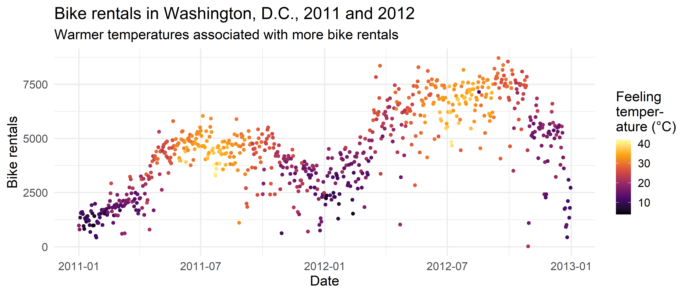

> Bike sharing systems are new generation of traditional bike rentals where whole process from membership, rental and return back has become automatic. Through these systems, user is able to easily rent a bike from a particular position and return back at another position. Currently, there are about over 500 bike-sharing programs around the world which is composed of over 500 thousands bicycles. Today, there exists great interest in these systems due to their important role in traffic, environmental and health issues. 

> Apart from interesting real world applications of bike sharing systems, the characteristics of data being generated by these systems make them attractive for the research. Opposed to other transport services such as bus or subway, the duration of travel, departure and arrival position is explicitly recorded in these systems. This feature turns bike sharing system into a virtual sensor network that can be used for sensing mobility in the city. Hence, it is expected that most of important events in the city could be detected via monitoring these data.

Dataset and description source: <http://archive.ics.uci.edu/ml/datasets/Bike+Sharing+Dataset>

Source of assignment tasks 1-15: 
<https://github.com/rstudio-education/datascience-box/tree/master/course-materials/starters/hw/hw-07-bike-rentals-dc>

```{r setup}
library(tidyverse)
theme_set(theme_minimal(base_size = 16))
knitr::opts_chunk$set(fig.width = 28 / 2.54, fig.height = 12 / 2.54)
```

```{r read-dataset}
bikeshare <- read_csv("bike-rentals-day.csv")
```


## Data wrangling

1\. Recode the season variable as a factor with meaningful level names as outlined in the codebook (_bike-rentals-readme.txt_), with spring as the baseline level.

```{r factor-season}
bikeshare <- bikeshare %>%
  mutate(season = factor(
    season, 
    levels = c(2, 3, 4, 1), 
    labels = c("spring", "summer", "fall", "winter")
  ))
bikeshare
```

2\. Recode the binary variables holiday and workingday to be factors with levels no (0) and yes (1), with no as the baseline level.

```{r factor-holiday-workingday}
bikeshare <-
  bikeshare %>%
  mutate(across(c(holiday, workingday), factor, labels = c("no", "yes")))
bikeshare
```

3\. Recode the `yr` variable to be a factor with levels 2011 and 2012, with 2011 as the baseline level.

```{r factor-year}
bikeshare <- bikeshare %>%
  mutate(yr = factor(yr, labels = c("2011", "2012")))
bikeshare
```

4\. Recode the `weathersit` variable as 1 - clear, 2 - mist, 3 - light precipitation, and 4 - heavy precipitation, with clear as the baseline.

```{r factor-weathersit}
bikeshare <- bikeshare %>%
  mutate(weathersit = factor(
    weathersit, 
    levels = 1:4,
    labels = c(
      "clear", 
      "mist", 
      "light precipitation", 
      "heavy precipitation"
    )))
bikeshare
```

5\. Calculate raw temperature, feeling temperature, humidity, and windspeed as their values given in the dataset multiplied by the maximum raw values stated in the codebook for each variable. 
Instead of writing over the existing variables, create new ones with concise but informative names.

```{r raw-temp-humidity-windspeed}
bikeshare <- bikeshare %>%
  mutate(temp_raw = temp * 41) %>%
  mutate(atemp_raw = atemp * 50) %>%
  mutate(hum_raw = hum * 100) %>%
  mutate(windspeed_raw = windspeed * 67)
bikeshare
```

6\. Check that the sum of casual and registered adds up to `cnt` for each record. 
Hint: One way of doing this is to create a new column that takes on the value TRUE if they add up and FALSE if not, and then checking if all values in that column are TRUEs. 
But this is only one way, you might come up with another.

```{r sanity-check}
bikeshare %>%
  summarize(all(casual + registered == cnt))
```

## Exploratory data analysis

7\. Recreate the following visualization, and interpret it in context of the data. 
Hint: You will need to use one of the variables you created above. 
The `"inferno"` colorscale from the [viridis](https://cran.r-project.org/web/packages/viridis/vignettes/intro-to-viridis.html) package is used.

```{r bike-rentals-plot}
ggplot(bikeshare, aes(x = dteday, y = cnt, color = atemp_raw)) +
  geom_point() +
  labs(
    x = "Date", y = "Bike rentals",
    title = "Bike rentals in Washington, D.C., 2011 and 2012",
    subtitle = "Warmer temperatures associated with more bike rentals",
    color = "Feeling\ntemper-\nature (°C)"
  ) +
  scale_color_viridis_c(option = "inferno")
```

```{r bike-rentals-plot-output}

```


8\. Create a visualization displaying the relationship between bike rentals and season. 
Interpret the plot in context of the data.

```{r bike-rentals-by-season-plot}
ggplot(bikeshare, aes(y = fct_rev(season), x = cnt)) +
  geom_boxplot(fill = "gray90") +
  labs(
    x = "Bike rentals",
    y = "Season",
    title = "Bike rentals in Washington, D.C., by season in 2011 and 2012"
  )
```

## Modelling

9\. Fit a linear model predicting total daily bike rentals from daily temperature. 
Write the linear model, interpret the slope and the intercept in context of the data, and determine and interpret the R².

```{r simple-lin-model-raw-temp}
library(tidymodels)
fit <- linear_reg() %>%
  set_engine("lm") %>%
  fit(formula = cnt ~ temp_raw, data = bikeshare)
fit %>% tidy()
fit %>% glance()

```

10\. Fit another linear model predicting total daily bike rentals from daily feeling temperature. 
Write the linear model, interpret the slope and the intercept in context of the data, and determine and interpret the R².
Is temperature or feeling temperature a better predictor of bike rentals? 
Explain your reasoning.

```{r simple-lin-model-raw-feel-temp}
fit <- linear_reg() %>%
  set_engine("lm") %>%
  fit(formula = cnt ~ atemp_raw, data = bikeshare)
fit %>% tidy()
fit %>% glance()
linear_reg() %>%
  set_engine("lm") %>%
  fit(formula = cnt ~ atemp_raw, data = bikeshare)
```

11\. Fit a model predicting total daily bike rentals from:

- season, 
- year, 
- whether the day is holiday or not, 
- whether the day is a workingday or not, 
- the weather category, 
- temperature, 
- feeling temperature, 
- humidity, 
- windspeed, and 
- the interaction between feeling temperature and holiday. 

Record adjusted R² of the model.

```{r multiple-lin-model}
fit <- linear_reg() %>%
  set_engine("lm") %>%
  fit(formula = cnt ~ season + yr + holiday  + workingday + weathersit + temp_raw + atemp_raw + hum + windspeed + atemp_raw*holiday, data = bikeshare) 
fit %>% tidy() %>% knitr::kable()
fit %>% glance()
```

12\. Write the linear models for holidays and non-holidays. 
Is the slope of temperature the same or different for these two models? 
How about the slope for feeling temperature? Why or why not?

13\. Interpret the slopes of season and feeling temperature. 
If the slopes are different for holidays and non-holidays, make sure to interpret both. 
If the variable has multiple levels, make sure you interpret all of the slope coefficients associated with it.

14\. Interpret the intercept. If the intercept is different for holidays and non-holidays, make sure to interpret both.

15\. According to this model, assuming everything else is the same, in which season does the model predict total daily bike rentals to be highest and which to be the lowest?

## Bonus - Predictive Power Score

16\. Conventional Pearson correlation has some shortcomings, e.g. it assumes linearity and is not designed to work with categorical variables.

For categorical variables, there exist other measures to assess the strength of bivariate relationships, including:

- point-biserial correlation (dichotomous vs. continuous), 
- ANOVA test (categorical vs. continuous),
- Chi-squared statistic, Cramer's V (categorical vs. categorical)

To tackle both of the shortcomings, consider the [Predictive Power Score](https://towardsdatascience.com/rip-correlation-introducing-the-predictive-power-score-3d90808b9598) as alternative measure which is capable of detecting also non-linear relationships and handles relationships between variables of different type.

The PPS for x on y is computed as follows:

1. Create a model (e.g. a decision tree) which predicts y from x. If y is continuous, a regression model is built, otherwise a classification model is built.
2. Compute the model's goodness of fit. The evaluation measure depends on the model type:
  - regression: MAE
  - classification: weighted F1 score
3. Normalize the model's goodness of fit to lie between 0 and 1 according to a _baseline_ model:
  - regression: the baseline model always predicts the mean of y
  - classification: the baseline model always predicts the majority class
  
TL;DR: The PPS is an _asymmetric_ measure of correlation capable of capturing both _linear_ and _non-linear_ relationships.
The score ranges from 0 (no predictive power) to 1 (perfect predictive power).

```{r pps, fig.width=20/2.54, fig.height=20/2.54, eval = FALSE}
library(ppsr)
# pps <- score_df(bikeshare %>% select(cnt, season, yr, holiday, workingday, weathersit, temp_raw, atemp_raw, hum, windspeed))

# backup
# write_rds(pps, "pps.rds")
pps <- read_rds("pps.rds") %>% as_tibble()

ggplot(pps, aes(x, y)) +
  geom_tile(aes(fill = pps)) +
  geom_text(aes(label = round(pps, 2), color = pps > 0.8), size = 12 / .pt) +
  scale_fill_distiller(palette = "Blues", direction = 1) +
  scale_color_manual(values = c("black", "white")) +
  guides(color = FALSE) +
  labs(
    x = NULL, y = NULL, fill = "Predictive\nPower\nScore", title = "PPS matrix",
    subtitle = "A value represents the predictive power that the\nx variable has on the y variable."
  ) +
  coord_equal() +
  theme(axis.text.x = element_text(angle = 325, hjust = 0, vjust = 0)) +
  theme(plot.subtitle = element_text(size = rel(1)))

```

Network visualization:

```{r pps-network, eval = FALSE}
library(corrr)
pps %>%
  select(x, y, pps) %>%
  group_by(x, y) %>%
  mutate(pps_max = max(pps)) %>%
  ungroup() %>%
  select(x, y, pps_max) %>%
  pivot_wider(names_from = y, values_from = pps_max) %>%
  column_to_rownames("x") %>%
  as_cordf() %>%
  corrr::network_plot(min_cor = 0) +
  scale_color_distiller(palette = "Blues", limits = c(0,1), direction = 1) +
  labs(color = "Maximum of\nPPS(x->y) and\nPPS(y->x)") +
  theme(legend.title = element_text(size = rel(1.07), face = "bold", margin = margin(b = 10)))
```

> Output a network plot of a correlation data frame in which variables that are more highly correlated appear closer together and are joined by stronger paths. The proximity of the points are determined using multidimensional clustering.
