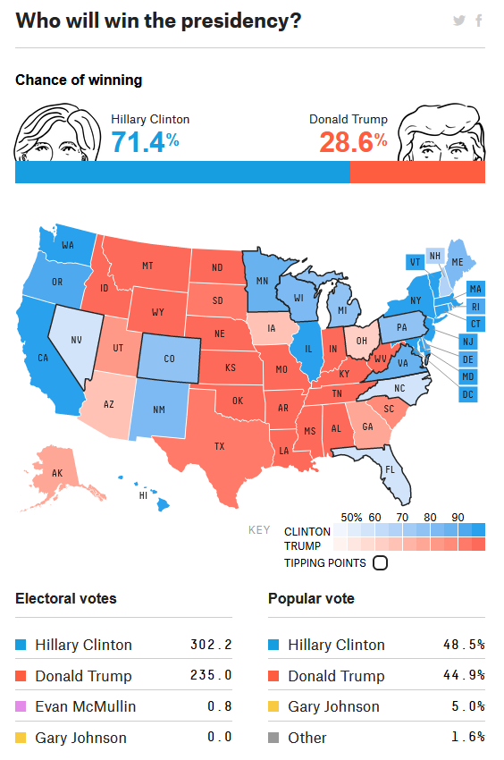
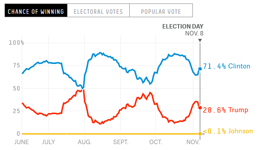
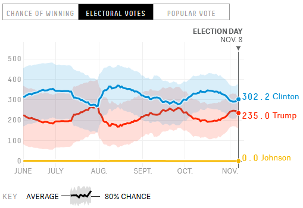

This week's code-along task description is adapted from: 

- <https://rstudio-education.github.io/datascience-box/course-materials/hw-instructions/hw-08/hw-08-exploring-gss.html>
- <https://rstudio-education.github.io/datascience-box/course-materials/hw-instructions/hw-09/hw-09-modeling-gss.html>

-----

The GSS gathers data on contemporary American society in order to monitor and explain trends and constants in attitudes, behaviors, and attributes. Hundreds of trends have been tracked since 1972. In addition, since the GSS adopted questions from earlier surveys, trends can be followed for up to 70 years.

The GSS contains a standard core of demographic, behavioral, and attitudinal questions, plus topics of special interest. Among the topics covered are civil liberties, crime and violence, intergroup tolerance, morality, national spending priorities, psychological well-being, social mobility, and stress and traumatic events.

In this assignment we analyze data from the 2016 GSS, using it to estimate values of population parameters of interest about US adults.

Smith, Tom W, Peter Marsden, Michael Hout, and Jibum Kim. General Social Surveys, 1972-2016 [machine-readable data file] /Principal Investigator, Tom W. Smith; Co-Principal Investigator, Peter V. Marsden; Co-Principal Investigator, Michael Hout; Sponsored by National Science Foundation. -NORC ed.- Chicago: NORC at the University of Chicago [producer and distributor].

```{r setup, include = FALSE}
library(tidyverse)
library(tidymodels)

# set default theme
theme_set(
  theme_minimal(base_size = 18) +
    theme(plot.title = element_text(size = rel(1.05)))
)

# set default figure dimensions
knitr::opts_chunk$set(fig.width = 24 / 2.54, fig.height = 18 / 2.54)
```

```{r load-data}
load("gss16.rda") 
```

Data frame documentation: <https://rstudio-education.github.io/dsbox/reference/gss16.html>

## Part 1: Harassment at work

In 2016, the GSS added a new question on harassment at work. 
The question is phrased as the following.

> Over the past five years, have you been harassed by your superiors or co-workers at your job, for example, have you experienced any bullying, physical or psychological abuse?

Answers to this question are stored in the `harass5` variable in our dataset.

1\. What are the possible responses to this question and how many respondents chose each of these answers?

```{r}
gss16 %>%
  count(harass5) %>%
  arrange(desc(n))
```

2\. What percent of the respondents for whom this question is applicable (i.e. excluding "NA"s and "Does not apply"s) have been harassed by their superiors or co-workers at their job?

```{r}
gss16 %>%
  filter(harass5 %in% c("No", "Yes")) %>%
  summarize(mean(harass5 == "Yes"))
```


## Part 2: Time spent on email

The 2016 GSS also asked respondents how many hours and minutes they spend on email weekly. 
The responses to these questions are recorded in the `emailhr` and `emailmin` variables. 
For example, if the response is 2.5 hrs, this would be recorded as `emailhr = 2` and `emailmin = 30`.

3\. Create a new variable called `email` that combines these two variables to report the number of minutes the respondents spend on email weekly.

```{r email-sol}
gss16 <- gss16 %>%
  mutate(email = emailhr * 60 + emailmin)
gss16
```

4\. Visualize the distribution of this new variable.
Find the mean and the median number of minutes respondents spend on email weekly. 
Is the mean or the median a better measure of the typical among of time Americans spend on email weekly? Why?

```{r}
ggplot(gss16, aes(x = email)) +
  geom_histogram(boundary = 0, binwidth = 200, fill = "gray90") +
  labs(
    x = "Minutes spennt on emails per week",
    y = "Frequency"
  ) +
  geom_vline(
    xintercept = median(gss16$email, na.rm = TRUE),
    linetype = "dashed", size = 1.5
  ) +
  geom_vline(
    xintercept = mean(gss16$email, na.rm = TRUE),
    linetype = "dotted", size = 1.5
  ) +
  annotate(
    "text", 
    x = 500, y = 900, label = "Mean", 
    hjust = 0, size = 16 / .pt
  ) +
  annotate(
    "text", 
    x = 180, y = 1000, label = "Median", 
    hjust = 0, size = 16 / .pt
  )
```


5\. Create another new variable, `snap_insta` that is coded as `"Yes"` if the respondent reported using any of Snapchat (`snapchat`) or Instagram (`instagrm`), and `"No"` if not. 
If the recorded value was NA for both of these questions, the value in your new variable should also be NA.

```{r}
gss16 <- gss16 %>%
  mutate(snap_insta = snapchat == "Yes" | instagrm == "Yes")
gss16
```


6\. Calculate the percentage of "Yes"'s for `snap_insta` among those who answered the question, i.e., excluding NAs.

```{r}
gss16 %>%
  summarize(100 * mean(snap_insta, na.rm = TRUE))
```


7\. What are the possible responses to the question "Last week were you working full time, part time, going to school, keeping house, or what?" and how many respondents chose each of these answers? 
Note that this information is stored in the `wrkstat` variable.

```{r}
gss16 %>%
  count(wrkstat) %>%
  arrange(desc(n))

library(janitor)
gss16 %>%
  tabyl(wrkstat) %>%
  arrange(desc(n))
```


8\. Fit a model predicting `email` (number of minutes per week spent on email) from `educ` (number of years of education), `wrkstat`, and `snap_insta`. 
Interpret the slopes for each of these variables.

```{r}
fit <- linear_reg() %>%
  set_engine("lm") %>%
  fit(email ~ educ + wrkstat + snap_insta, data = gss16)
fit %>% tidy()
```


9\. Create a predicted values vs. residuals plot for this model. 
Are there any issues with the model? If yes, describe them.


```{r}
augment(fit$fit) %>%
  ggplot(aes(x = .fitted, y = .resid)) +
  geom_point() +
  geom_smooth(method = "lm")
```

```{r}
fit <- linear_reg() %>%
  set_engine("lm") %>%
  fit(
    email ~ educ + wrkstat + snap_insta, 
    data = gss16 %>%
      mutate(email = log(email + 1))
      )
fit %>% tidy()

```
```{r}
(exp(0.193) - 1) * 100
```

```{r}
augment(fit$fit) %>%
  ggplot(aes(x = .fitted, y = .resid)) +
  geom_point() +
  geom_smooth(method = "lm")
```


## Part 3: Political views and science research

The 2016 GSS also asked respondents whether they think of themselves as liberal or conservative (`polviews`) and whether they think science research is necessary and should be supported by the federal government (`advfront`).

The question on science research is worded as follows:

> Even if it brings no immediate benefits, scientific research that advances the frontiers of knowledge is necessary and should be supported by the federal government.

And possible responses to this question are "Strongly agree", "Agree", "Disagree", "Strongly disagree", "Don't know", "No answer", "Not applicable".

The question on political views is worded as follows:

> We hear a lot of talk these days about liberals and conservatives. I'm going to show you a seven-point scale on which the political views that people might hold are arranged from extremely liberal–point 1–to extremely conservative–point 7. Where would you place yourself on this scale?

Note: The levels of this variables are spelled inconsistently: "Extremely liberal" vs. "Extrmly conservative". Since this is the spelling that shows up in the data, you need to make sure this is how you spell the levels in your code.

And possible responses to this question are "Extremely liberal", "Liberal", "Slightly liberal", "Moderate", "Slghtly conservative", "Conservative", "Extrmly conservative". Responses that were originally "Don't know", "No answer" and "Not applicable" are already mapped to NAs upon data import.

10\. In a new variable, recode `advfront` such that "Strongly agree" and "Agree" are mapped to "Yes", and "Disagree" and "Strongly disagree" are mapped to "No". The remaining levels can be left as is.

```{r advfront-sol}
gss16 <- gss16 %>%
  mutate(advfront = case_when(
    advfront %in% c("Strongly agree", "Agree") ~ "Yes",
    advfront %in% c("Disagree", "Strongly disagree") ~ "No",
    TRUE ~ advfront
  ))
gss16 %>%
  tabyl(advfront)
```

11\. In a new variable, recode `polviews` such that "Extremely liberal", "Liberal", and "Slightly liberal" are mapped to "Liberal", and "Slghtly conservative", "Conservative", and "Extrmly conservative" are mapped to "Conservative". The remaining levels can be left as is. Make sure that the levels are in a reasonable order.

```{r polviews-sol}
gss16 <- gss16 %>%
  mutate(polviews = case_when(
    polviews %in% c("Extremely liberal", "Liberal", "Slightly liberal") ~ "Liberal",
    polviews %in% c("Slghtly conservative", "Conservative", "Extrmly conservative") ~ "Conservative",
    TRUE ~ polviews
  ))
gss16 %>% tabyl(polviews)
```

12\. Create a visualization that displays the relationship between these two new variables and interpret it.

```{r polviews-advfront-barchart}
gss16 %>% 
  filter(across(c(polviews, advfront), ~ !is.na(.x))) %>%
  mutate(polviews = fct_relevel(polviews, "Liberal", "Moderate")) %>%
  ggplot(aes(x = fct_rev(advfront), fill = polviews)) + 
  geom_bar(position = "fill") + # 
  labs(
    x = "\"Science research is necessary and should be\nsupported by the federal government\"",
    y = "Frequency",
    fill = "Political\nstance",
    title = "Relationship between position on support for science\nand political stance"
  )
```

## Part 4: Predictive modelling: scientific research

In this section we're going to build a model to predict whether someone agrees or doesn't agree with the following statement:

> Even if it brings no immediate benefits, scientific research that advances the frontiers of knowledge is necessary and should be supported by the federal government.
The responses to the question on the GSS about this statement are in the `advfront` variable.

13\.  Re-level the `advfront` variable such that it has two levels: `Strongly agree` and "`Agree"` combined into a new level called `agree` and the remaining levels (except `NA`s) combined into "`Not agree"`. Then, re-order the levels in the following order: `"Agree"` and `"Not agree"`. Finally, `count()` how many times each new level appears in the `advfront` variable.

```{r advfront-relevel-sol}
gss16 <- gss16 %>%
  mutate(
    advfront = fct_recode(
      advfront, 
      "Not agree" = "Dont know", 
      "Not agree" = "No", 
      "Agree" = "Yes"
    )
  ) %>%
  mutate(advfront = factor(advfront, levels = c("Agree", "Not agree")))
gss16 %>%
  count(advfront)
```

14\.  Create a new data frame called `gss16_advfront` that includes the variables `advfront`, `educ`, `polviews`, and `wrkstat`. Then, use the `drop_na()` function to remove rows that contain `NA`s from this new data frame. 

```{r gss16-advfront}
gss16_advfront <- gss16 %>%
  select(advfront , educ, polviews , wrkstat) %>%
  drop_na()
gss16_advfront
```

15\.  Split the data into training (75%) and testing (25%) data sets. Make sure to set a seed before you do the `initial_split()`. Call the training data `gss16_train` and the testing data `gss16_test`. Sample code is provided below. Use these specific names to make it easier to follow the rest of the instructions.

```{r holdout-split}
set.seed(123)
gss16_split <- initial_split(gss16_advfront)
gss16_train <- training(gss16_split)
gss16_test  <- testing(gss16_split)
gss16_train
gss16_test
```

16\. Create a recipe with the following steps for predicting `advfront` from `polviews`, `wrkstat`, and `educ`. Name this recipe `gss16_rec_1`. (We'll create one more recipe later, that's why we're naming this recipe `_1`.) Sample code is provided below.

- `step_other()` to pool values that occur less than 10% of the time (`threshold = 0.10`) in the `wrkstat` variable into `"Other"`.
- `step_dummy()` to create dummy variables for `all_nominal()` variables that are predictors, i.e. `all_predictors()`

```{r recipe}
gss16_rec_1 <- recipe(advfront ~ polviews + wrkstat + educ, data = gss16_advfront) %>%
  step_other(wrkstat, threshold = 0.1, other = "Other") %>%
  step_dummy(all_nominal(), -all_outcomes())
gss16_rec_1
```

17\. Specify a logistic regression model using `"glm"` as the engine. Name this specification `gss16_spec`. Sample code is provided below.

```{r glm}
gss16_spec <- logistic_reg() %>%
  set_engine("glm")
gss16_spec
```

18\. Build a workflow that uses the recipe you defined (`gss16_rec_1`) and the model you specified (`gss16_spec`). Name this workflow `gss16_wflow_1`. Sample code is provided below.

```{r workflow}
gss16_wflow_1 <- workflow() %>%
  add_model(gss16_spec) %>%
  add_recipe(gss16_rec_1)
```

19\. Perform 5-fold cross validation. 
More specifically,

- split the training data into 5 folds (don't forget to set a seed first!),
- apply the workflow you defined earlier to the folds with `fit_resamples()`, and
- `collect_metrics()` and comment on the consistency of metrics across folds (you can get the area under the ROC curve and the accuracy for each fold by setting `summarize = FALSE` in `collect_metrics()`)
- report the average area under the ROC curve and the accuracy for all cross validation folds `collect_metrics()`

```{r cv}
set.seed(123)
gss16_folds <- vfold_cv(gss16_advfront, v = 5)
gss16_fit_rs_1 <- gss16_wflow_1 %>%
  fit_resamples(gss16_folds)
collect_metrics(gss16_fit_rs_1, summarize = FALSE)
collect_metrics(gss16_fit_rs_1)
```

20\. Now, try a different, simpler model: predict `advfront` from only `polviews` and `educ`. 
More specifically,

- update the recipe to reflect this simpler model specification (and name it `gss16_rec_2`),
- redefine the workflow with the new recipe (and name this new workflow `gss16_wflow_2`),
- perform cross validation, and
- report the average area under the ROC curve and the accuracy for all cross validation folds `collect_metrics()`.

```{r}
gss16_rec_2 <- recipe(advfront ~ polviews + educ, data = gss16_advfront) %>%
  step_dummy(all_nominal(), -all_outcomes())

gss16_wflow_2 <- gss16_wflow_1 %>%
  update_recipe(gss16_rec_2)
gss16_fit_rs_2 <- gss16_wflow_2 %>%
  fit_resamples(gss16_folds)
collect_metrics(gss16_fit_rs_2, summarize = FALSE)
collect_metrics(gss16_fit_rs_2)
```


21\. Comment on which model performs better (one including `wrkstat`, model 1, or the one excluding `wrkstat`, model 2) on the training data based on area under the ROC curve.


22\. Fit both models to the testing data, plot the ROC curves for the predictions for both models, and calculate the areas under the ROC curve.

```{r}
model_1 <- gss16_wflow_1 %>%
  fit(data = gss16_train)

p1 <- model_1 %>%
  predict(new_data = gss16_test, type = "prob") %>%
  mutate(truth = gss16_test$advfront) %>%
  roc_curve(truth = truth, .pred_Agree) %>%
  autoplot() +
  labs(title = "ROC curve for model_1") +
  theme(text = element_text(size = 18))

model_2 <- gss16_wflow_2 %>%
  fit(data = gss16_train)

p2 <- model_2 %>%
  predict(new_data = gss16_test, type = "prob") %>%
  mutate(truth = gss16_test$advfront) %>%
  roc_curve(truth = truth, .pred_Agree) %>%
  autoplot() +
  labs(title = "ROC curve for model_2") +
  theme(text = element_text(size = 18))


library(patchwork)
p1 + ((p2 + p2) / (p1 + p1))


```


## Part 5: Confidence intervals using `infer`: harassment at work

> **Statistical inference**: the process of using data analysis to infer properties of an underlying distribution of probability for a population the sample came from.

A **confidence interval** is a plausible range of values for the population parameter.

Example: the experiment of flipping a fair coin 10 times and counting the number of heads. Do we expect the outcome to be the same if we repeat the experiment (multiple times)? 
Suppose the number of heads is 6. Would we be surprised if in the next trial the outcome is 9?

Example: the way the media reported on Hillary Clinton's chances of winning the 2016 U.S. presidential election

```{r us-elections-2016}




```

Figures source: <https://projects.fivethirtyeight.com/2016-election-forecast/>

[This blog post](https://senseaboutscienceusa.org/biggest-stats-lesson-2016/) summarizes lessons learned for the media concerning the coverage of election forecasts from the U.S. presidential elections 2016 including reporting on uncertainty:

> "While pollsters will be reworking their models following the election, what can media journalists do to improve their overall coverage of statistical issues in the future? (...) Second, always provide measures of uncertainty, and root these uncertainties in real-world examples. Providing tangible examples, like our earlier two-coin flip scenario, can help readers better relate to statistical ideas."

The coin-flip statement refers to the following section:

> "Other articles also pointed out that, prior to the election, Americans did not understand how to interpret a 29 percent probability—the FiveThirtyEight prediction of a Donald Trump win.  As we mentioned earlier, this probability is slightly higher than the chance of two heads in two coin flips." 

-----

We can quantify the variability of sample statistics using

- simulation, e.g., via bootstrapping
- theory: Central Limit Theorem (beyond the scope of this course) 

### Bootstrapping procedure

i\. Take a **bootstrap sample**, i.e., a random sample with replacement from the original sample that has the same size as the original sample\
ii\. Calculate the bootstrap **statistic**, e.g., mean, median, sum, proportion, slope, etc.\
iii\. Repeat steps i and ii many time to create a bootstrap distribution, i.e., a distribution of bootstrap statistics\
iv\. Calculate the **bounds** of the _c_% confidence interval as the middle _c_% of the bootstrap distribution 

-----

In 2016, the GSS added a new question on harassment at work.
The question is phrased as the following.

> Over the past five years, have you been harassed by your superiors or co-workers at your job, for example, have you experienced any bullying, physical or psychological abuse?
Answers to this question are stored in the `harass5` variable in our dataset.

23\. Create a subset of the data that only contains `Yes` and `No` answers for the harassment question. How many responses chose each of these answers?

```{r}
gss16 %>%
  count(harass5)

harass <- gss16 %>%
  filter(harass5 %in% c("Yes", "No"))
harass %>% count(harass5)
```


24\. Describe how bootstrapping can be used to estimate the proportion of Americans who have been harassed by their superiors or co-workers at their job.

```{r}
set.seed(123)
library(infer)
boot_df <- harass %>%
  specify(response = harass5, success = "Yes") %>%
  generate(reps = 10000, type = "bootstrap") %>%
  calculate(stat = "prop")
boot_df
```


25\. Calculate a 95% bootstrap confidence interval for the proportion of Americans who have been harassed by their superiors or co-workers at their job. Interpret this interval in context of the data.

```{r}
ggplot(boot_df, aes(x = stat)) +
  geom_histogram(bins = 15) +
  labs(title = "Bootstrap distribution of proportions")
```

```{r}
boot_ci <- boot_df %>%
  summarize(
    lower = quantile(stat, 0.025),
    upper = quantile(stat, 0.975)
  )
boot_ci
```

```{r}
ggplot(boot_df, aes(x = stat)) +
  geom_histogram(bins = 20, color = "white") +
  geom_vline(xintercept =  boot_ci$lower, color = "blue", size = 1.25) +
  geom_vline(xintercept =  boot_ci$upper, color = "blue", size = 1.25) +
  annotate(
    "segment", x = boot_ci$lower, xend = boot_ci$upper, y = 200, yend = 200,
    arrow = arrow(ends = "both", type = "closed"), color = "white", size = 1.25
  ) +
  annotate(
    "label", label = "95% confidence interval",
    x = boot_ci$lower + 0.5 * (boot_ci$upper - boot_ci$lower),
    y = 220, vjust = 0, size = 14/.pt
  ) +
  labs(title = "Bootstrap distribution of proportions")
```


26\. The 95% confidence interval for the proportion of Americans who have been harassed by their superiors or co-workers at their job was calculated as (15.3%, 19.2%). 
Which of the following is the correct interpretation of this interval?

(a) 95% of the time the proportion of Americans in this sample who have been harassed at their work is between 15.3% and 19.2%. 

```{r}
harass %>%
  summarize(mean(harass5 == "Yes"))
```


(b) For any random sample of Americans 95% of the time the proportion of people who have been harassed at work is between 15.3% and 19.2%.


(c) We are 95% confident that the proportion of people in this dataset who have been harassed at their job is between 15.3% and 19.2%.


(d) We are 95% confident that the proportion of people who have been harassed at their job is between 15.3% and 19.2%.


27\. Would you expect a 90% confidence interval to be wider or narrower than the interval you calculated above? Explain your reasoning.

```{r 90-ci-sol}
boot_ci_2 <- boot_df %>%
  summarize(
    lower = quantile(stat, 0.05),
    upper = quantile(stat, 0.95)
  )
boot_ci_2
```

```{r 90-vs-95-ci-sol}
ggplot(boot_df, aes(x = stat)) +
  geom_histogram(bins = 20, color = "white") +
  geom_vline(xintercept =  boot_ci$lower, color = "blue", size = 1.25) +
  geom_vline(xintercept =  boot_ci$upper, color = "blue", size = 1.25) +
  geom_vline(xintercept =  boot_ci_2$lower, color = "red", size = 1.25) +
  geom_vline(xintercept =  boot_ci_2$upper, color = "red", size = 1.25) +
  labs(title = "Bootstrap distribution of proportions",
       subtitle = "90% CI: red; 95% CI: blue")
```
