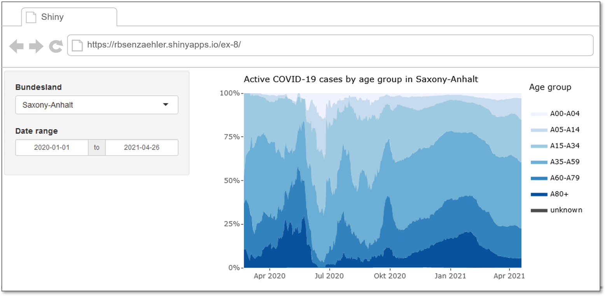

Recreate the Shiny app at <https://rbsenzaehler.shinyapps.io/ex-8/> using the dataset `RKI_COVID19.rds`.

```{r shiny-app}

```

Tip: You can use the code of the stacked area plot from the slides on functions and iteration.

You can convert a static ggplot2 object to an interactive plot using the `plotly::ggplotly()` function. 