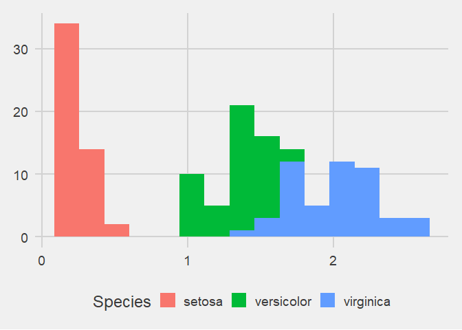

Example R Markdown targets file
================

Run `tar_make()` to generate the output `report.md` and its
dependencies. Because we use `tar_load()` and `tar_read()` below,
`targets` knows `report.md` depends on targets `fit`, and `hist`.

``` r
tar_load("fit")
print(fit)
```

    ## 
    ## Call:
    ## lm(formula = Sepal.Width ~ Petal.Width + Species, data = my_data)
    ## 
    ## Coefficients:
    ##       (Intercept)        Petal.Width  Speciesversicolor   Speciesvirginica  
    ##             3.236              0.781             -1.501             -1.844

``` r
tar_read(hist)
```

<!-- -->

More:

-   Walkthrough: [this chapter of the user
    manual](https://books.ropensci.org/targets/walkthrough.html#walkthrough)
